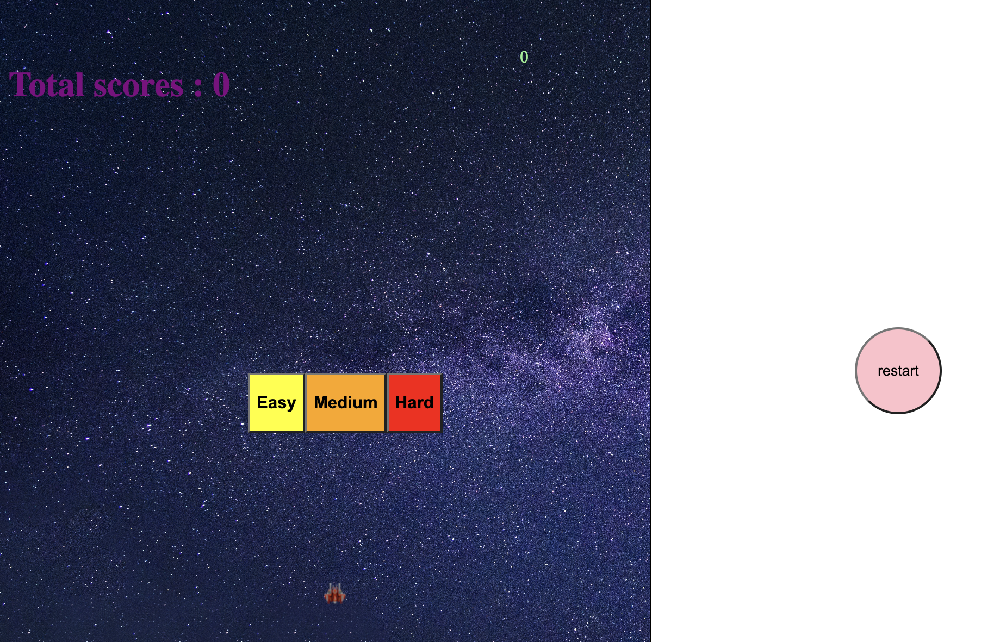
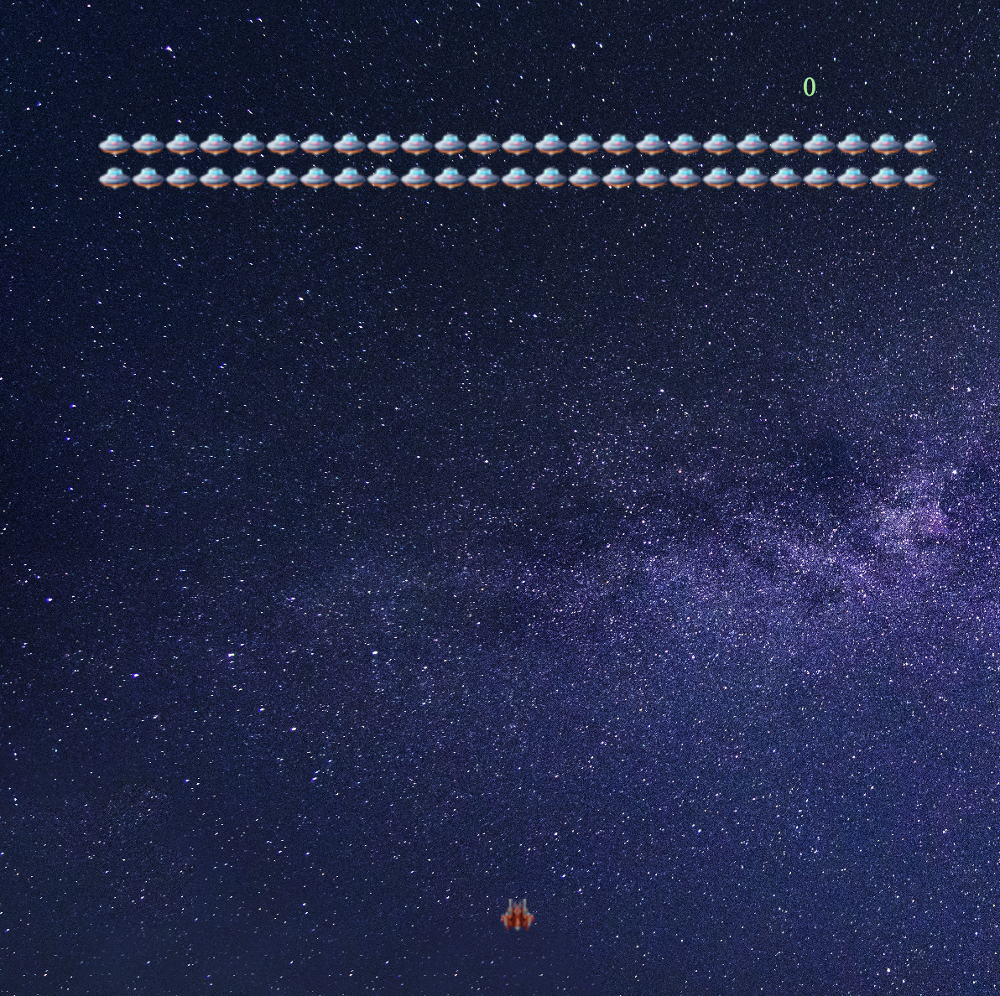
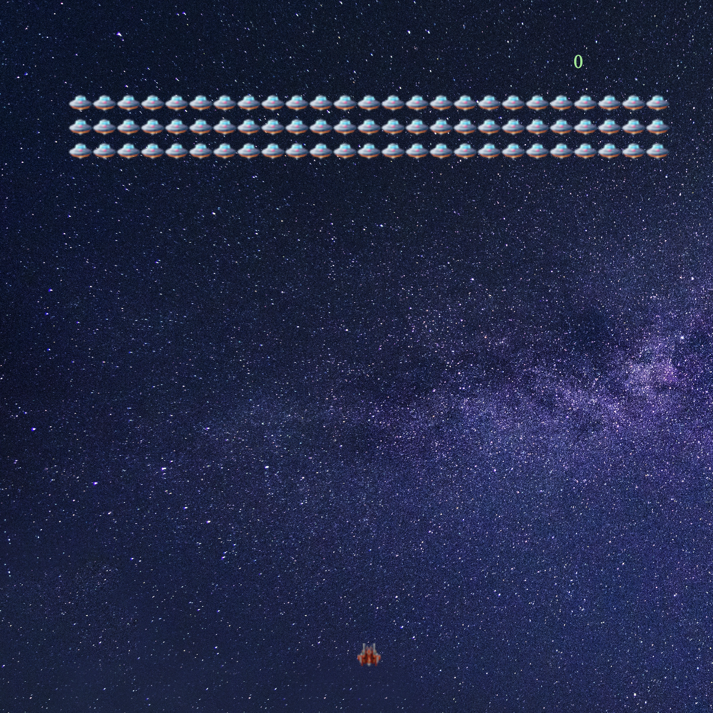
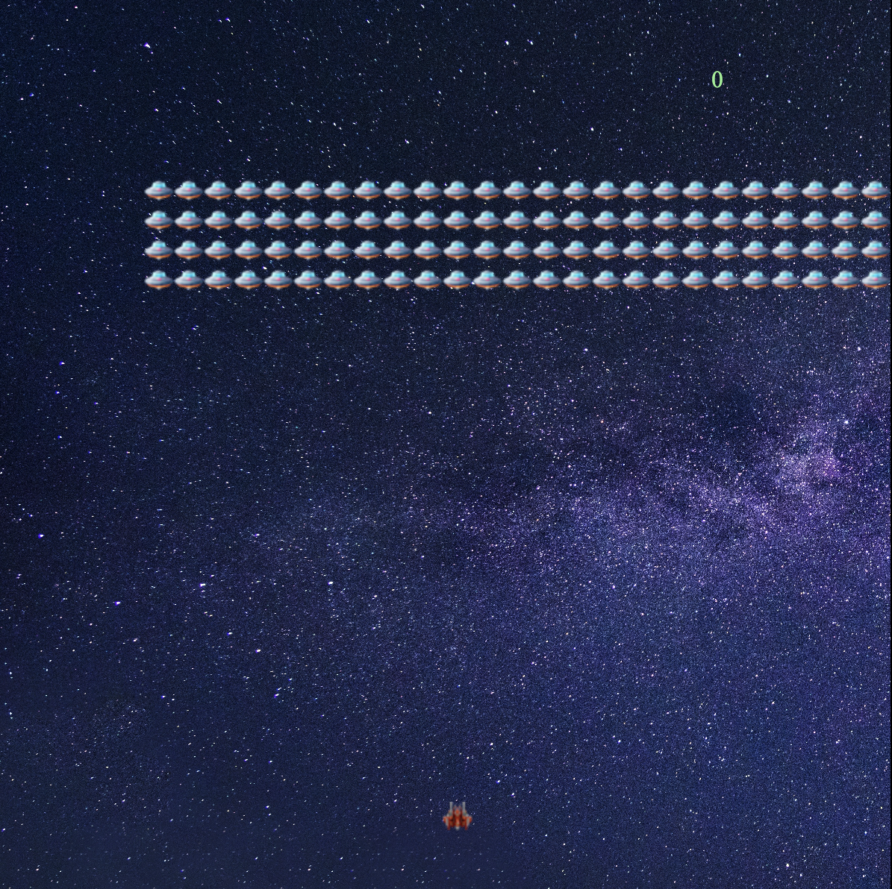
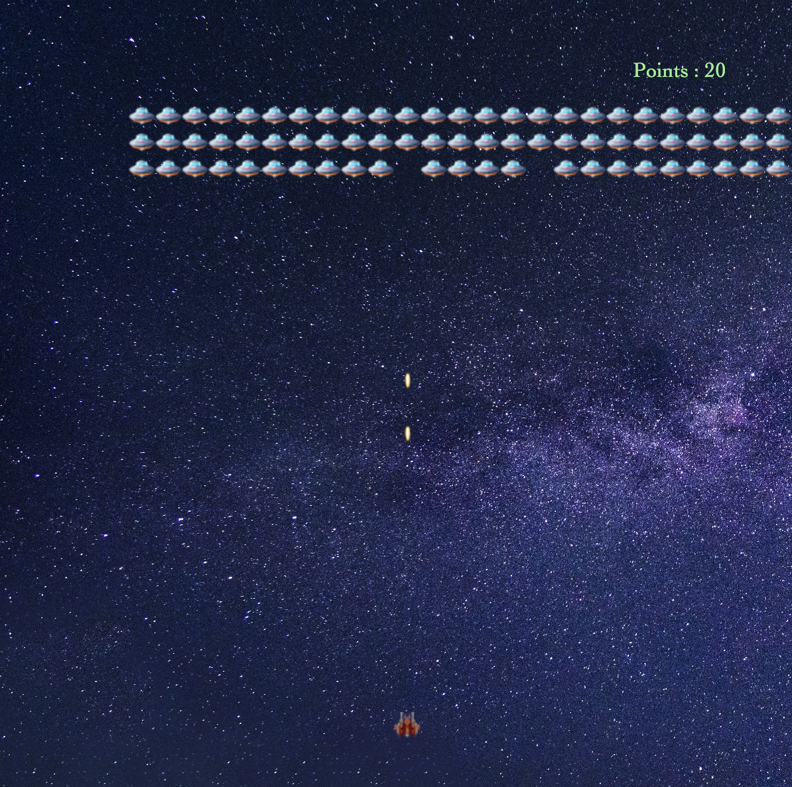
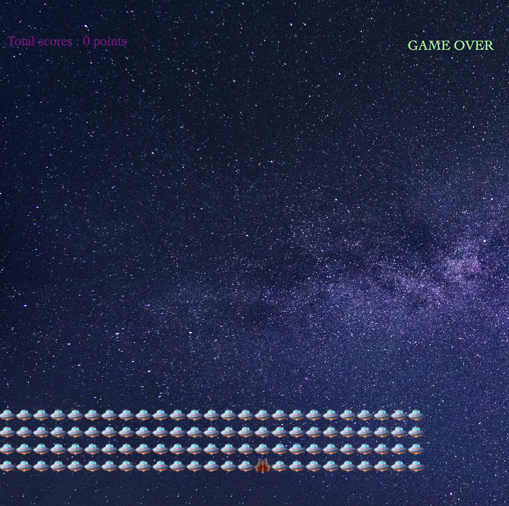

# Space_Battle

## Game Link
(https://louiskok888.github.io/Space_Battle/)

## Technologies
1. HTML 5
1. CSS
1. Javascript

## Game Instruction
- When loading the game, three buttons will be shown on the page.
- The three buttons are Easy, medium and Hard.
- Press one of the button to activate the game in different levels.
- Easy level will deploy two lines of aliens with normal speed.
- Medium level will deploy three lines of aliens with faster speed.
- Hard level will deploy three lines of aliens with faster speed than medium level.
- Player need to eliminate all the aliens by shooting them.
- Each eliminated aliens will be given 10 points.

## Screenshot Picture

###  🛸 Game start page

### 🛸 Easy level

### 🛸 Medium level

### 🛸 Hard level

### 🛸 Space ship shooting

### 🛸 Game over page

1. Description

1. De

## Additional features were under Considerations
-
-
